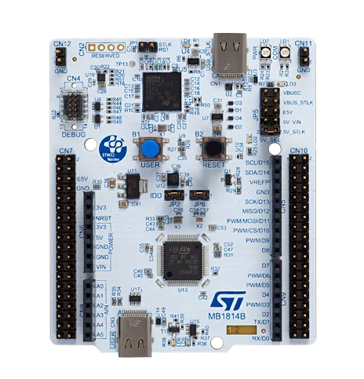

# **NUCLEO-H503RB** BSP Introduction

[中文页](README_zh.md) |

## Introduction

This document records the execution instruction of the BSP (board support package) provided by the RT-Thread development team for the NUCLEO-STM32H503RB  development board.

The document is covered in three parts:

- NUCLEO-STM32H503RB  Board Resources Introduction
- Quickly Get Started
- Advanced Features

By reading the Quickly Get Started section developers can quickly get their hands on this BSP and run RT-Thread on the board. More advanced features will be introduced in the Advanced Features section to help developers take advantage of RT-Thread to drive more on-board resources.

## Board Resources Introduction

The NUCLEO-STM32H503RB is a development board introduced by ST, based on the ARM Cortex-M33 core. It operates at a maximum frequency of 250MHz and comes equipped with 128KB Flash and 32KB RAM. This development board offers abundant onboard resources, allowing for the full utilization of the STM32H503RB chip's performance capabilities.

The appearance of the development board is as shown in the following picture.



The mainly-used **on-board resources** are shown as follows:

- MCU: The STM32H563ZI is a high-performance microcontroller unit (MCU) featuring an Arm Cortex-M33 with TrustZone. The MCU is equipped with 2 MB Flash, 640 KB RAM, a 250 MHz CPU, and achieves 375 DMIPS (Dhrystone 2.1).

- Common features
  - STM32 microcontroller in an LQFP64 or LQFP48 package
  - 1 user LED shared with ARDUINO®
  - 1 user and 1 reset push-buttons
  - 32.768 kHz crystal oscillator
  - Board connectors:
    - ARDUINO® Uno V3 expansion connector
    - ST morpho extension pin headers for full access to all STM32 I/Os
  - Flexible power-supply options: ST-LINK USB VBUS or external sources
  - On-board ST-LINK debugger/programmer with USB re-enumeration capability: mass storage, Virtual COM port, and debug port
  - Comprehensive free software libraries and examples available with the STM32Cube MCU Package
  - Support of a wide choice of Integrated Development Environments (IDEs) including IAR Embedded Workbench®, MDK-ARM, and STM32CubeIDE

#### For more details about this board, please refer to the [ST official documentation](https://www.st.com/en/evaluation-tools/nucleo-h503rb.html)


### Peripheral Condition

Each peripheral supporting condition for this BSP is as follows:

| **On-chip Peripheral Drivers**          | **Support** | **Remark** |
| --------------------------------------- | ----------- | ---------- |
| GPIO                                    | Support     |            |
| UART                                    | Support     | UART3      |
| USB to Serial (Onboard **STLINK-V3EC**) | Support     |            |
| PWM                                     | Support     |            |
| ADC                                     | Support     |            |

## User Manual

The user manual is divided into the following two sections:

- Quick Start

  This section is designed for beginners who are new to RT-Thread. By following simple steps, you can run the RT-Thread operating system on the development board and observe the experimental results.

- Advanced Usage

  This section is intended for developers who need to leverage more development board resources on the RT-Thread operating system. By using the ENV tool to configure the Board Support Package (BSP), you can enable additional onboard resources and implement more advanced functionalities.

### Quickly Get Started

This BSP provides MDK5 and IAR projects for developers. Also support GCC development environment. Here's an example of the MDK5 development environment, to introduce how to run the system.

#### Hardware Connection

Connect the development board to the PC using a Type-C data cable.

#### Compile And Download

Double-click the `project.uvprojx` file, to open the MDK5 project, compile and download the program to the board.

> By default, the project uses ST_LINK simulator to download the program, when the ST_LINK connects the board, clicking the download button can download the program to the board.

### Running Results

After the program is successfully downloaded, the system runs automatically. Observe the running results of the LED on the development board, the  LED1 will flash periodically.

Connect the corresponding serial port of the development board to the PC. Open the corresponding serial port in the terminal tool (115200-8-1-N). After resetting the device, you should be able to see the output information from RT-Thread.

```
 \ | /
- RT -     Thread Operating System
 / | \     5.1.0 build Dec 22 2023 16:30:30
 2006 - 2022 Copyright by RT-Thread team
msh >
```

### Advanced Features

This BSP only enables GPIO and serial port 1 by default. If need more advanced features, you need to configure the BSP with RT-Thread Env tools, as follows:

- Open the [Env](https://www.rt-thread.io/download.html?download=Env) tool under this BSP;

- Enter the `menuconfig` command to configure the project, then save and exit;

- Enter the `pkgs --update` command to update the packages;

- Enter the  `scons --target=mdk4/mdk5/iar` command to regenerate the project.

  

## Notes

- Debugging UART3 is mapped as per the configuration in STM32CubeMX.

- Currently, using CubeProgrammer for flashing.


## References:

1. [STM32H503RB Official Introduction](https://www.st.com/en/microcontrollers-microprocessors/stm32h503rb.html)
2. [STM32H503-NUCLEO Development Board Introduction](https://www.st.com/en/evaluation-tools/nucleo-h503rb.html#overview)


## Maintained By

[Shicheng Chu](https://github.com/zihao-yuan/)  1468559561@qq.com
